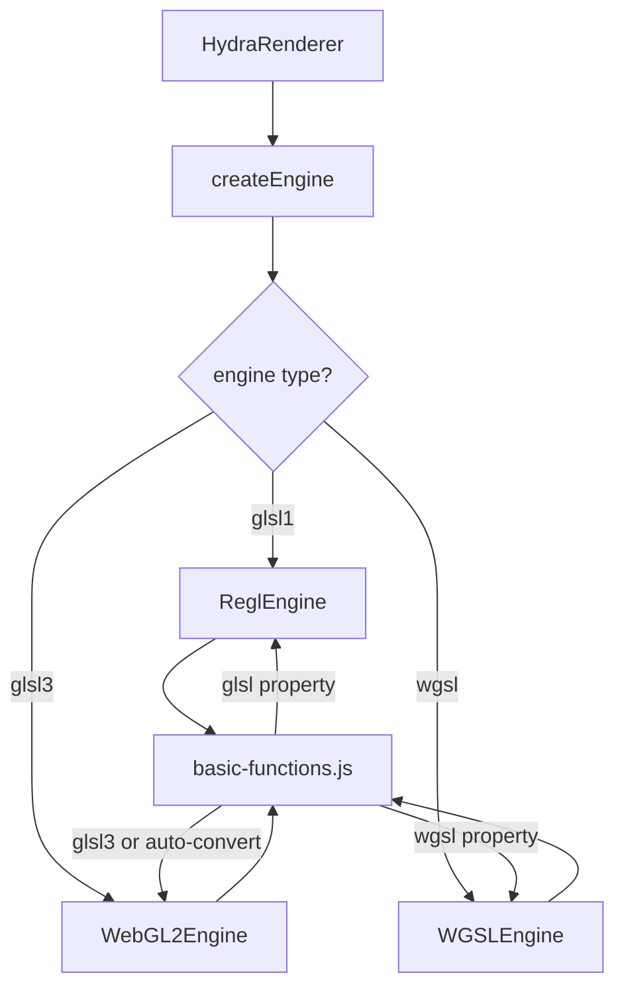

# Hydra Synth - Rendering Engine Abstraction & Unified Shaders

## Summary

Implemented a modular rendering engine abstraction system supporting **GLSL1**, **GLSL3**, and **WGSL (WebGPU)** via a plugin architecture. Refactored the shader management to use a **unified shader format**, allowing a single definition to support multiple languages.

## Files Created

### Engine System (`src/engines/`)

| File | Description |
|------|-------------|
| `IRenderEngine.js` | Abstract interface defining rendering engine contract |
| `ReglEngine.js`    | WebGL1/GLSL1 engine using regl (default) |
| `WebGL2Engine.js`  | Native WebGL2/GLSL3 engine |
| `WGSLEngine.js`    | Native WebGPU/WGSL engine |
| `index.js`         | Engine registry and factory function |

### Unified Shader System (`src/shaders/`)

| File | Description |
|------|-------------|
| `basic-functions.js` | Unified shader definitions (GLSL1, GLSL3, WGSL) |
| `utility-functions.js` | Unified utility functions (GLSL, WGSL) |
| `gaussian.frag` | GLSL fragment shader for gaussian blur |
| `renderpass-functions.js` | Multi-pass effect definitions (WIP) |

## Unified Shader Format

Shader functions in `basic-functions.js` now support multiple implementations:

```javascript
/* src/shaders/basic-functions.js */
{
  name: 'osc',
  type: 'src',
  inputs: [ ... ],
  
  // PRIMARY: GLSL ES 1.0 (WebGL1) - Required
  glsl: `return sin(time);`,

  // OPTIONAL: GLSL ES 3.0 (WebGL2)
  // If omitted, engine auto-converts glsl (texture2D -> texture)
  glsl3: `return sin(time);`,

  // OPTIONAL: WGSL (WebGPU)
  // Required for WGSLEngine support
  wgsl: `return sin(uniforms.time);`
}
```

## Files Removed/Deprecated

- `src/glsl/` (directory removed)
- `glsl3-functions.js` (merged into basic-functions.js)
- `glsl3-utility-functions.js` (merged into utility-functions.js)
- `wgsl-functions.js` (merged into basic-functions.js)
- `wgsl-utility-functions.js` (merged into utility-functions.js)

## Usage Examples

### Default (GLSL1)
```javascript
const hydra = new Hydra({ canvas: c }) // uses ReglEngine
```

### WebGL2 (GLSL3)
```javascript
const hydra = new Hydra({ 
  canvas: c,
  engine: 'glsl3' // or 'webgl2'
})
```

### WebGPU (WGSL)
```javascript
const hydra = new Hydra({ 
  canvas: c, 
  engine: 'wgsl' // or 'webgpu'
})
```

## Architecture



## Build Info

- **ESM Bundle**: `dist/hydra-synth.esm.js` (~490KB)
- **IIFE Bundle**: `dist/hydra-synth.js` (~520KB)
- **Minification**: Builds are essentially largely similar in size due to deduplicated shader code.
